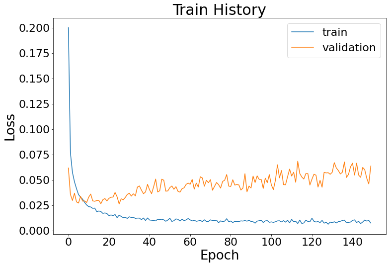
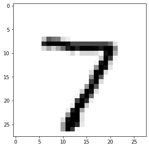

# Machine_Learning

## 專案介紹
本專案使用 Python 程式語言，利用 Tesorflow Keras 套件對 MNIST 手寫數字進行機器學習辨識。

## 專案技術
Python 3.9、Tesorflow 2.11.0

## 資料夾說明
* fig - 圖片放置處
* model - 機器學習模型放置處
  * assets - 靜態資源放置處
  * variables - 模型變數放置處

## 畫面
### 訓練過程


### 範例
以下使用 MNIST 的第 0 筆測試資料作為範例
``` python
plt.imshow(data_test_x[0], cmap='Greys')
```

``` python
predict = model.predict(data_test_x)
print("Probability:\n", predict[0])
print("Predicted number is:", predict[0].argmax())
```
```
Probability:
[0.0000000e+00 0.0000000e+00 7.0817629e-31 2.0787209e-33 0.0000000e+00
 0.0000000e+00 0.0000000e+00 1.0000000e+00 0.0000000e+00 2.1166898e-18]
Predicted number is: 7
```
